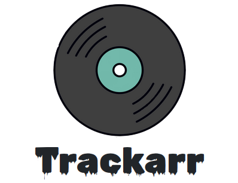

<p align="center">

</p>
<div align="center">
  <strong>Game Collection Tracker</strong></div>
<div align="center">
  a <code>self-hosted</code> solution.
</div>
<br />
<div align="center">
  <!-- Node version -->
    
  <!-- Go version -->
    
  <!-- Build Status -->
  
</div>
<div align="center">
  <!-- iOS -->
  
  <!-- Android -->
  
  <!-- Web -->
  
</div>
<div align="center">
  <sub>A simple self-hosted game collection tracker. Built with ❤︎ by
  <a href="https://twitter.com/#">codevski</a> and
  <a href="#">
    contributors
  </a>
</div>

## Table of Contents

- [Table of Contents](#table-of-contents)
- [Feature](#feature)
- [How to use](#how-to-use)

## Feature

- **Tracking:** Track games you own, played, and want to play.
- **Customization:** Organize and categorize games with custom notes and ratings.
- **Import/Export:** Easy import and export of game data to and from Trackarr. Transfer your data seamlessly between different devices or share with friends.

Tracker is a self-hosted solution for managing your game collection. It allows you to keep track of the games you own, the games you've played, and the games you want to play in the future. With Tracker, you can customize your collection with custom notes and ratings, and easily import and export your game data. The app can be hosted on your own server for complete control and privacy.

## How to use

Frontend
Install dependencies

```bash
npm install
# or
yarn
```

Run the development server:

```bash
npm run dev
# or
yarn dev
```

Open [http://localhost:3000](http://localhost:3000) with your browser to see the result.

Backend

- Install [Go](https://golang.org/doc/install)

- Run `go run main.go` to start the server.

API running on port `8000`
